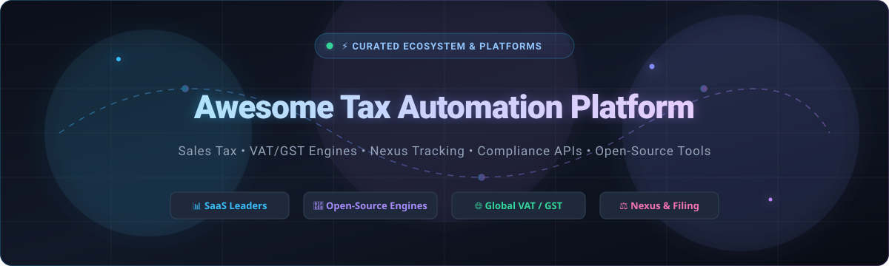

# 🚀 Awesome Tax Automation Platform

**A curated ecosystem of enterprise SaaS platforms, developer APIs, and open-source tax calculation engines.**

  <b>Covering:</b> Sales Tax • Global VAT / GST • Nexus Monitoring • Exemption Certificates • E-Invoicing • Returns Filing • Developer SDKs

---

## 📖 Overview

The **Awesome Tax Automation Platform** directory is an authoritative reference guide for finance leaders, tax technology specialists, and software engineers building multi-jurisdiction commerce systems.

Navigating modern indirect tax compliance requires automated determination, continuous rate lookup, real-time economic nexus monitoring, exemption certificate tracking, and e-invoicing. This guide tracks both enterprise-grade **SaaS platforms** and developer-friendly **Open-Source engines**.

> 💡 **SEO Keywords & Taxonomy:** `tax-automation`, `sales-tax-api`, `vat-compliance`, `gst-calculation`, `economic-nexus-monitoring`, `indirect-tax`, `e-invoicing`, `exemption-certificate-management`, `fintech-compliance`, `tax-filing-automation`.

---

## 📑 Table of Contents

- [🏢 SaaS & Hosted Platforms](#-saas--hosted-platforms)
- [💻 Open-Source GitHub Projects](#-open-source-github-projects)
- [🛠️ Frameworks & Architecture for Custom Systems](#️-frameworks--architecture-for-custom-systems)
- [📈 Star History](#-star-history)
- [🤝 How to Contribute](#-how-to-contribute)
- [⚖️ Disclaimer](#️-disclaimer)

---

## 🏢 SaaS & Hosted Platforms

The table below catalogs the leading commercial tax automation providers, sorted in **descending order by company size** (market capitalization / enterprise valuation / annual revenue).

| Platform | Company Size (Valuation / Revenue) | Description | Starting Pricing | Free Tier / Trial Limit |
| :--- | :--- | :--- | :--- | :--- |
| **[Thomson Reuters ONESOURCE](https://www.thomsonreuters.com/)** | **~$75B Market Cap** / ~$7.2B Annual Revenue | Comprehensive global tax technology suite spanning indirect tax, corporate income tax, transfer pricing, and provision for global multinational corporations. | Starts at **~$10,000/year** (base modular packages for indirect/direct tax and reporting) | **No free-forever tier**; 30-day limited trial available for select modules upon sales evaluation |
| **[Stripe Tax](https://stripe.com/tax)** | **~$70B Valuation** / ~$14B+ Annual Revenue | Developer-first tax calculation and collection engine natively built into Stripe payments, supporting sales tax, VAT, and GST in 50+ countries. | **0.5% per transaction** (no-code / Checkout) or **$0.50/transaction** (API); **0.4% per transaction** with Stripe Billing | **Free-forever Test Mode** with unlimited sandbox calculations + 100% free automated economic nexus and threshold monitoring |
| **[Avalara](https://www.avalara.com/)** | **~$8.4B Valuation** (Acquired by Vista Equity) / ~$1B+ ARR | Industry-standard indirect tax automation engine covering sales tax, VAT, GST, customs duties, returns filing, and exemption certificates in 190+ jurisdictions. | Starts at **$799/state/year** (Core Compliance, 3-state minimum = ~$2,397/yr); basic services start at ~$119/license | **90-day free developer trial** (API/SDK testing capped at 1,000 transactions/day, 5 req/min, no credit card required; no free live filing tier) |
| **[Vertex](https://www.vertexinc.com/)** | **~$6.5B Market Cap** (NASDAQ: VERX) / ~$650M Annual Revenue | Enterprise-grade indirect tax determination and compliance platform built for complex global supply chains, multi-entity ERPs, and omnichannel retail. | Starts at **~$5,000/year** for SMB Cloud connectors; enterprise deployments scale from $10,000–$100,000+/year | **No free-forever tier**; guided sandbox pilot/demo available upon enterprise sales request |
| **[Sovos](https://sovos.com/)** | **~$3.0B+ Valuation** / ~$500M+ Annual Revenue | Global indirect tax compliance platform specializing in continuous transaction controls (CTC), e-invoicing compliance, VAT determination, and 1099 reporting. | Starts at **~$3,000/year** (base indirect tax and 1099 reporting tiers) | **No free-forever tier**; 7-day sandbox trial on select modules/APIs upon sales consultation |
| **[Corptax](https://www.corptax.com/)** | **~$3.0B+ Enterprise Parent** (CSC) / ~$1.5B+ Annual Revenue | Enterprise corporate tax software providing end-to-end provision, preparation, multi-state filing, and lifecycle compliance management. | Starts at **~$80,000/year** (average enterprise deployment for corporate tax provision & compliance modules) | **No free-forever tier**; guided sandbox demonstration and proof-of-concept on request via sales team |
| **[TaxJar (Avalara)](https://www.taxjar.com/)** | **Acquired by Avalara** ($8.4B parent org) / ~$50M+ ARR | Modern e-commerce and subscription sales tax platform delivering automated state calculation, nexus tracking dashboards, and AutoFile returns. | Starts at **$39/month** (Starter tier, up to 200 orders/month, 3 integrations, 2 AutoFile credits/yr); Professional from $99/month | **30-day free trial** (up to 200 orders, full access to integrations and nexus dashboard, no credit card required) |
| **[Anrok](https://www.anrok.com/)** | **~$250M Valuation** (Series B) / High-Growth SaaS Specialist | Modern tax compliance platform specifically designed for SaaS, digital subscriptions, and remote-first software companies with global customer bases. | Starts at **$499/month** ($5,988/year billed annually) + 0.30%–0.40% per taxable transaction (Starter tier) | **No free-forever tier**; 7-day trial available via select marketplace/partner integrations |
| **[Canopy](https://www.canopytax.com/)** | **~$150M+ Valuation** (Series BB) / ~$20M+ ARR | Cloud-based tax practice management and workflow automation software built specifically for accounting firms and CPA practices. | Starts at **$74/user/month** (Standard plan billed annually) / $109/user/month (Plus plan) | **Free-forever tier** for Client Management (up to 500 contacts, includes client portal & mobile app); **14-day free trial** for full practice management features |
| **[Blue dot](https://www.bluedotcorp.com/)** | **~$100M+ Valuation** (Series C) / ~$15M+ ARR | AI-powered tax compliance engine that analyzes employee spend and travel & expense (T&E) data for automated VAT recovery and fringe benefit tax compliance. | Starts at **~$15,000/year** (based on employee expense volume and ERP/SAP Concur connectors) | **No free-forever tier**; custom proof-of-concept (POC) sandbox trial upon enterprise sales evaluation |

---

## 💻 Open-Source GitHub Projects

The following open-source projects provide calculation logic, rate lookups, VAT validation, and tax engines for developer integration. Repositories are sorted in **descending order by GitHub stars**.

- **[UsTaxes](https://github.com/ustaxes/UsTaxes)**   
  *Open-source, privacy-centric web application for preparing and calculating US federal and state income taxes locally in the browser.*

- **[vat-calculator (Laravel)](https://github.com/laravel/vat-calculator)**   
  *Comprehensive PHP/Laravel package for handling European Union VAT (EU MOSS) regulations, EU VAT number validation, and localized tax rate calculations.*

- **[node-sales-tax](https://github.com/valeriansaliou/node-sales-tax)**   
  *High-performance international sales tax, VAT, and GST calculation library for Node.js and TypeScript applications supporting multi-country rules.*

- **[Tax-Calculator (PSLmodels)](https://github.com/PSLmodels/Tax-Calculator)**   
  *Microsimulation model and calculation engine for US federal individual income and payroll tax liability modeling maintained by the Policy Simulation Library.*

- **[commerceguys/tax](https://github.com/commerceguys/tax)**   
  *Modular PHP tax management library handling compound tax rates, zone-based rate determination, and European VAT reverse-charge rules.*

- **[openfisca-core](https://github.com/openfisca/openfisca-core)**   
  *Rules-as-code calculation engine written in Python for turning complex tax laws and benefit regulations into executable micro-services and APIs.*

- **[policyengine-us](https://github.com/PolicyEngine/policyengine-us)**   
  *Open-source Python simulation platform and engine for computing US tax liabilities, tax credits, and public benefit eligibility under federal and state law.*

- **[taxjar-node](https://github.com/taxjar/taxjar-node)**   
  *Official Node.js client library for interacting with TaxJar's real-time sales tax calculation and order transaction APIs.*

- **[taxjar-ruby](https://github.com/taxjar/taxjar-ruby)**   
  *Ruby gem and SDK for automated sales tax calculation, postal code rate lookup, and customer tax exemption validation.*

- **[OpenTax (Filed Open Tax Engine)](https://github.com/filedcom/opentax)**   
  *Single-binary CLI and calculation engine written in Go for deterministic US federal income tax calculation designed for developer and AI agent workflows.*

- **[opencollective-taxes](https://github.com/opencollective/opencollective-taxes)**   
  *Open-source JavaScript microservice and library for calculating VAT and sales taxes on digital products, events, and crowdfunded transactions.*

- **[open-sales-tax](https://github.com/ejosterberg/open-sales-tax)**   
  *Self-hostable US sales tax calculation engine utilizing Streamlined Sales Tax (SST) boundary data and per-state taxability rules.*

- **[VAT_Calculator](https://github.com/vbresan/VAT_Calculator)**   
  *Open-source Android and mobile VAT calculator supporting configurable JSON rate tables across 160+ countries.*

---

## 🛠️ Frameworks & Architecture for Custom Systems

When architecting an in-house tax engine or hybrid compliance infrastructure, consider the following blueprint:

1. **⚡ Address Validation & Geo-Coding:** Standardize billing/shipping addresses (e.g., USPS CASS / Google Places) before tax determination to prevent district boundary misclassifications.
2. **🌐 Real-Time Tax Determination:** Deploy libraries like `node-sales-tax` or `vat-calculator` for instantaneous checkout latency (<50ms).
3. **📊 Economic Nexus Aggregation:** Maintain real-time state revenue and transaction count counters to alert finance teams prior to breaching state statutory thresholds ($100k / 200 transactions).
4. **📁 Exemption Lifecycle:** Integrate digital exemption certificate collection (SST Form, resale certs) at the point of customer account creation.
5. **🔄 Remittance & Filing:** Combine open calculation engines with official government filing APIs (or commercial filing connectors like Avalara/TaxJar) for automated monthly returns.

---

## 📈 Star History

---

## 🤝 How to Contribute

We welcome community contributions! To add a new platform or open-source tool:

1. 🍴 **Fork** this repository.
2. 🌿 **Create a new branch** (`git checkout -b add-my-tax-tool`).
3. 📝 **Add your entry** following the existing format:
   - For SaaS: Platform name, link, company size valuation, description, starting price, and free tier/trial limits.
   - For Open-Source: Project name, link, social star badge, and concise functional description.
4. 🚀 **Submit a Pull Request** with a brief summary of the project.

---

## ⚖️ Disclaimer

- This repository is a **community-curated list** for informational and engineering reference only.
- Tax compliance, rates, and laws vary drastically by jurisdiction and evolve frequently.
- Open-source calculation packages and automated software do not constitute legal, accounting, or professional tax advice. Always consult a certified public accountant (CPA) or tax attorney before filing returns or remitting taxes.

---

  <b>Built with ❤️ for finance, tax, and software engineering teams worldwide.</b>

